# Penetration-Testing-Project
Penetration testing on Mediroza General Hospital Website.
# ⚠️ Liabitlity Disclaimer
I have performed these activities only on the Website where I had secured written permission or the devices/systems that I own myself. All these materials are for education and research purpose only. Do not use anything from here to break the law. The instructor, the authors and Networkwalks are not responsible for what you do with this knowledge. Every action you take is your own responsibility. Misuse can lead to criminal charges, heavy fines, loss of your job and a permanent record. In most countries unauthorised access is a crime even when nothing is damaged.

**Author:** Ketan Kamble  
**Batch:** B083 | Week 4  
**Target:** https://medirozahospital.com  
**Engagement Type:** Black-box Penetration Test  
**Duration:** 5 Days  
**Authorization:** Written permission granted by Mediroza General Hospital (via NetworkWalks training engagement)


# 📌 1. Executive Summary
This engagement identified three critical vulnerabilities in Mediroza General Hospital's web infrastructure: an authentication bypass via SQL injection on the patient portal, a publicly exposed database backup containing staff and shareholder records, and weak/dictionary-crackable passwords protecting confidential patient lab reports. Together, these findings would allow an unauthenticated attacker to access any patient's medical records and the hospital's internal HR and ownership data without any valid credentials.

# 2. Scope and Methodology
**Scope**: Full black-box penetration test limited to medirozahospital.com and its subpaths. No social engineering, denial-of-service, or out-of-scope testing was performed.  

**Tools Used**: `whois`, `nslookup`, `dnsrecon`, `whatweb`, `wafw00f`, `curl`, `networkwalks hash calculator`, `networkwalks password cracker`

**Approach:**
1. Passive reconnaissance — WHOIS, DNS records, HTTP headers, technology fingerprinting (`whatweb`, `wafw00f`)
2. Content discovery — reviewed `robots.txt` for disallowed/hidden paths
3. Directory and file enumeration on disallowed paths (`/old/`, `/patient/`, `/staff/`)
4. Authentication testing on discovered login forms
5. Post-exploitation file retrieval and offline password cracking

# 3. Findings and Proof of Exploitation
## 1. Reconnaissance & Scanning
Collecting Information about the target using various Kali Linux tools, like whois, whatweb, etc.  
• **Whois**:  
Whois revealed the registrar, registration and expiry dates, and name servers of the target.  
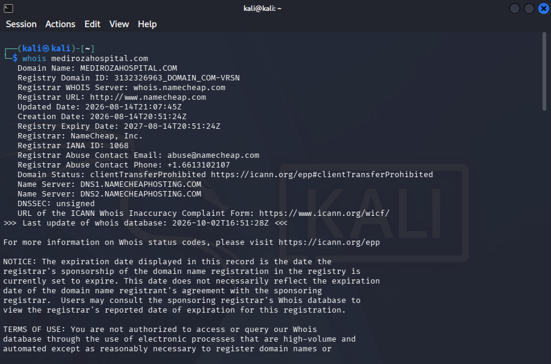

• **Whatweb**:  
Watweb exposed the exact software and versions target using.  
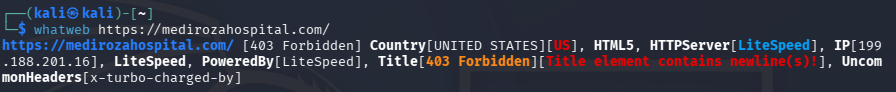

• **Nslookup**:  
nslookup turned the domain name of target into its real IP address.  
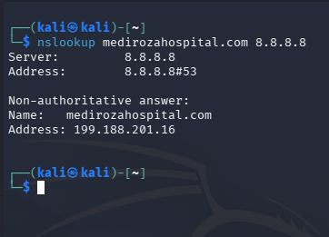

• **Curl**:  
To check HTTP headers leak the web server, catching stack and hidden endpoints of the target.
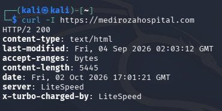

• **Wafw00f**:  
Used Wafw00f to chek target firewall is monitoring or not.
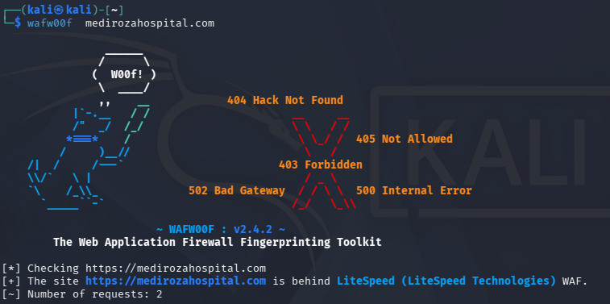

• **Dnsrecon**:  
Used dnsrcon for target's entire DNS footprint: mail servers, DNS software version, SPF policy and cPanel service records.  
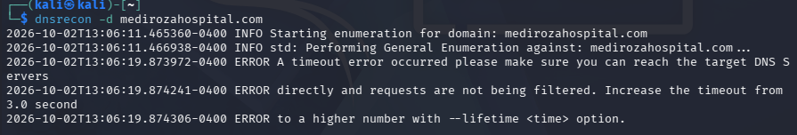  

## 2. Gaining Access
Gaining access of the target and looking for Important Resources and Findings.  
• **SQL Injection — Authentication Bypass (Critical)**  
**Location:** `/patient/login.php`

The patient portal login form was vulnerable to a classic SQL injection authentication bypass. The backend query concatenated raw user input directly into a SQL statement without sanitization or parameterization, of the form:
```sql
SELECT * FROM users WHERE username='$username' AND password='$password'
```

**Payload used:** `username=admin'-- -&password=pass`

This caused the password check to be commented out entirely, granting an authenticated session without any valid credentials.

**Evidence:** `HTTP 302` redirect to `portal.php` with a new `PHPSESSID` session cookie, versus `"Username not found"` on a legitimate failed login attempt.
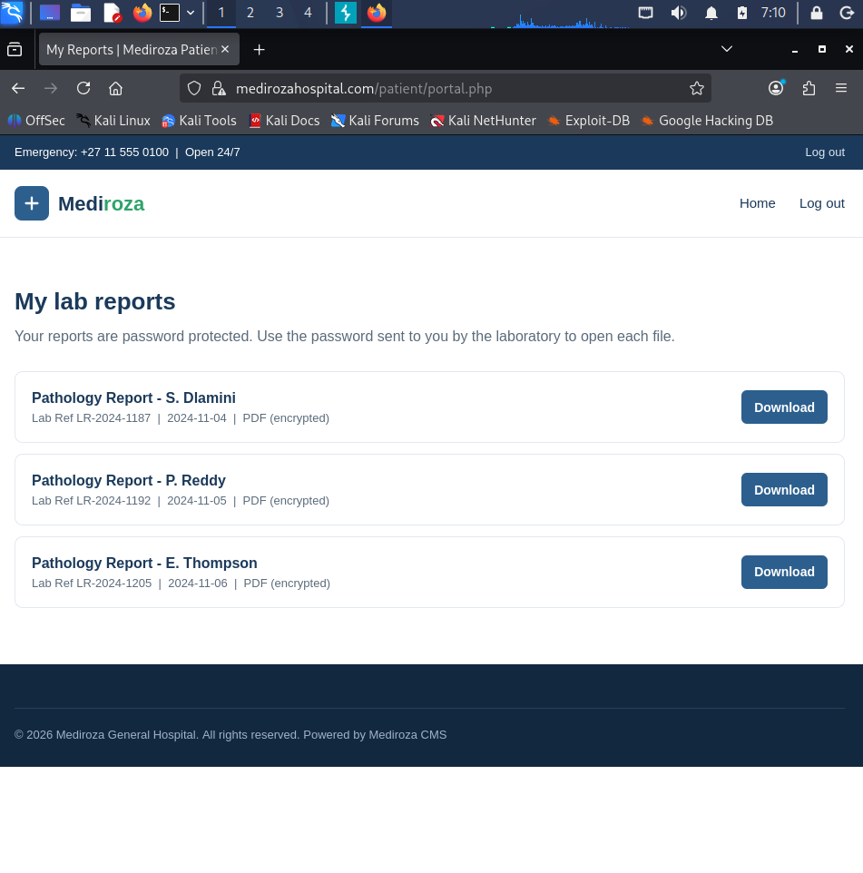 
**Impact:** Full unauthenticated access to any patient's lab reports via the portal.

• **Weak PDF Encryption Passwords (Medium)**
**Location:** Patient lab report PDFs

The three retrieved patient lab reports were password-protected PDFs. All three were cracked offline using `pdfcrack`/`john` with a standard wordlist (rockyou.txt) within minutes.

**Passwords recovered:** weak, dictionary-common values (e.g. `123456`, `password`) and a short symbol-only pattern — none met minimum password complexity standards.
**1. Passwords:**
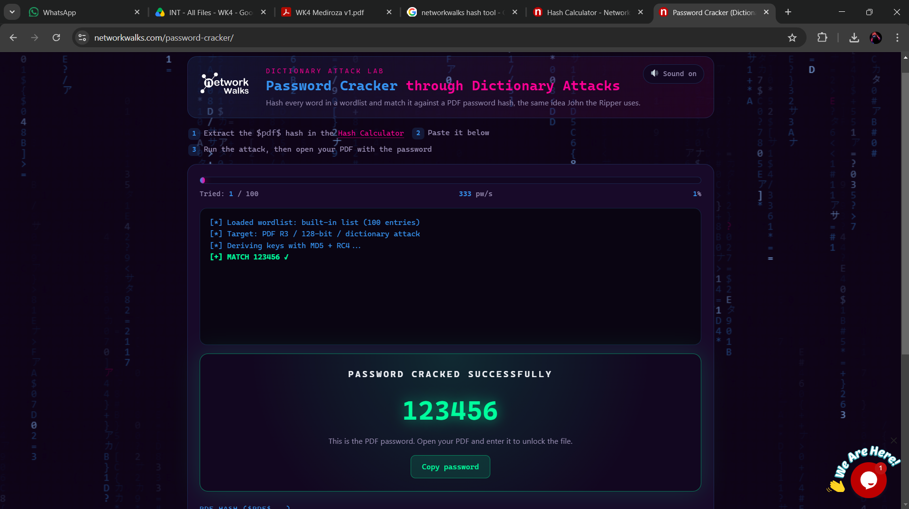  

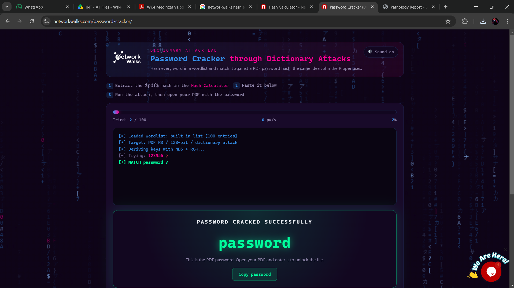  

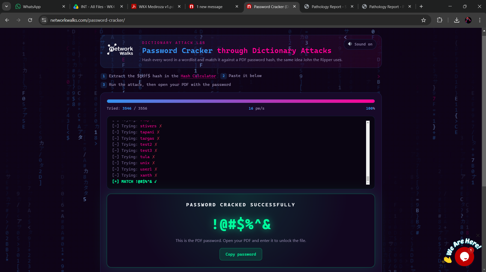  

**2. File Contents:**  

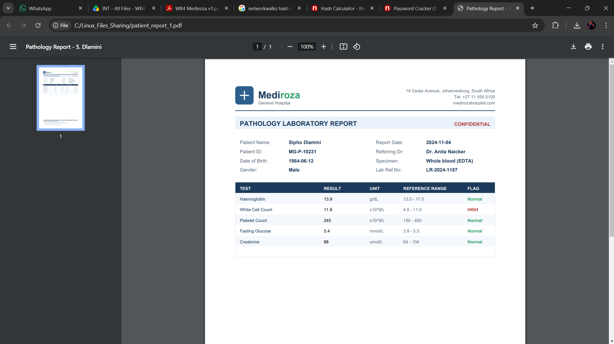  

  

  


*Impact:* Even if the SQLi vulnerability were fixed, weak encryption passwords provide minimal protection for sensitive medical data.

• **Sensitive Data Exposure — Publicly Accessible Database Backup (Critical)**  
**Location:** `/old/mediroza_db_backup_2019.sql`

The site's `robots.txt` disclosed the existence of a disallowed `/old/` directory. This directory had directory listing (autoindex) enabled and contained an unauthenticated, publicly downloadable SQL database backup.

**Data exposed:**  
- `staff` table — 30 records: full name, job title, department, email, phone, **national ID number**, **monthly salary**
- `shareholders` table — 10 records: name, shareholding percentage, shares held, share class
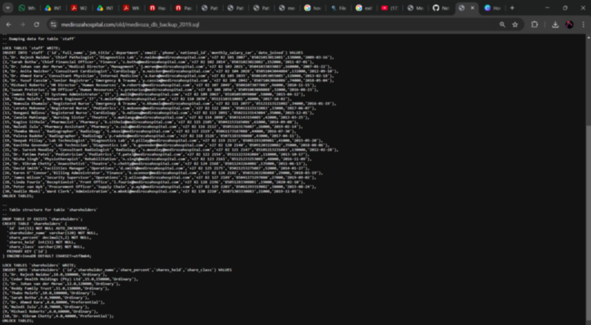  

## 4. Risk Rating Summary

| Finding | Severity | CVSS-style Justification |
|---|---|---|
| SQL Injection — Auth Bypass | Critical | Unauthenticated full account takeover; direct access to PHI |
| Weak PDF Passwords | Medium | Requires prior access; weak secondary control |
| Exposed Database Backup | Critical | Unauthenticated PII, financial, and ownership data disclosure |

## 5. Recommendations and Remediation

1. **Fix SQL Injection:** Use parameterized queries / prepared statements for all database interactions. Never concatenate raw user input into SQL strings.
2. **Remove or secure `/old/`:** Delete legacy/backup files from publicly accessible web directories immediately; store backups outside the webroot with proper access controls. Disable directory listing (autoindex) server-wide.
3. **Enforce strong password policy:** Require minimum length/complexity for any password-protected documents; consider replacing static PDF passwords with per-session authenticated access instead.
4. **Don't rely on `robots.txt` for security:** It is a crawler directive, not an access control — sensitive paths should require authentication, not just crawler exclusion.
5. **Add rate limiting and WAF rules** on login endpoints to slow down automated injection/brute-force attempts.

## 6. Conclusion

This engagement demonstrates how a chain of low-effort findings — an overly-informative `robots.txt`, directory listing left enabled, unsanitized SQL queries, and weak document passwords — combine into a critical compromise of patient and corporate data. Immediate remediation of the SQL injection and exposed backup file is strongly recommended before any production deployment.

---
*Conducted under written authorization as part of NetworkWalks Batch B083 training
